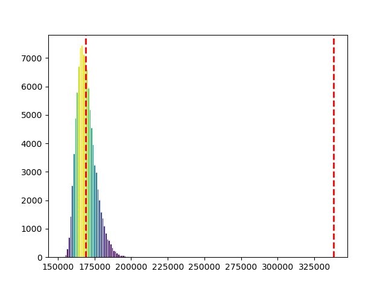

## LVQuickSort

L'algoritmo è stato implementato in C++ nel file swap.cpp, il programma utilizza la eastl e i thread per velocizzare l'esecuzione del programma.

Il programma è stato eseguito 100000 volte su un array di 10000 elementi generati randomicamente

Il grafico sottostante rappresenta la quantità di comparazioni fatte nel codice ad ogni run.

Le linee verticali rosse rappresentano rispettivamente da sinistra a destra: $\mu$ e $2\mu$, ottenute calcolando la media delle comparazioni delle esecuzioni fatte. 

Si può naturalmente norare che $2\mu$ è incredibilmente lontano da tutti i dati ottenuti.

## MCQuickSort

Con la media ottenuta sopra, risolvendo l'equazione sottostante, si può ottenere la base del logaritmo da dare al MCQuickSort per fargli produrre il "valore corretto" per la stima grossolana dello pseudo codice fornito

$$ 1000\times log_{x}(10000) = \mu $$

Fatto ciò e mettendo il k del MCQuickSort a 1 si può notare che la probabilità che MCQuickSort fallisca anche solo una volta è così piccola che succede molto raramente.

Abbiamo la seguente formula con $\epsilon = 10^{-5}$
$$P(X \geq 2\mu) \leq \epsilon$$

Possiamo dire con questi dati che, su una lista di $10^4$ elementi, la probabilità che il las vegas quicksort ci metta più di $2\mu$ è minore di 1 caso su 100000 (0.001% o $1 \over 1000$).

Come conseguenza il MCQuickSort(S, 3), dovendo ripetere il caso peggiore 3 volte di seguito per fallire, ha una probabilità di fallire nell'ordinamento della lista pari a $(10^{-5})^3$, ovvero avviene, in media, una volta ogni miliardo di miliardi di run dell'algoritmo